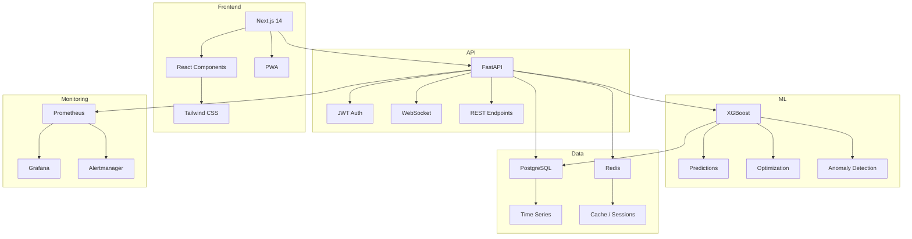

# Energy Optimizer Pro

**AI-Powered Building Energy Management System**

[](https://github.com/vinsblack/energy-optimizer-pro)
[](LICENSE)
[](https://github.com/vinsblack/energy-optimizer-pro/actions)
[](https://github.com/vinsblack/energy-optimizer-pro)

Transform building energy consumption with machine learning. Achieve 15-35% energy savings, reduce CO2 emissions by up to 25%, and reach ROI in 6-18 months.

[Get Started](#quick-start) | [Documentation](docs/) | [API Reference](http://localhost:8000/docs)

---

## Overview

Energy Optimizer Pro is a full-stack platform for monitoring, analyzing, and optimizing building energy consumption using advanced ML algorithms. It supports multi-building portfolios, real-time monitoring, predictive analytics, and automated optimization recommendations.

### Key Capabilities

- **Real-time monitoring** with WebSocket-based live dashboards
- **ML-powered optimization** using XGBoost, LightGBM, and Random Forest
- **Predictive analytics** for energy usage forecasting and anomaly detection
- **Executive reporting** with PDF exports, cost tracking, and sustainability metrics
- **Role-based access control** with JWT authentication and audit logging
- **Progressive Web App** with mobile support and offline capability

---

## Architecture


```mermaid
graph TB
    subgraph Frontend
        A[Next.js 14] --> B[React Components]
        B --> C[Tailwind CSS]
        A --> D[PWA]
    end
    subgraph API
        E[FastAPI] --> F[JWT Auth]
        E --> G[WebSocket]
        E --> H[REST Endpoints]
    end
    subgraph ML
        I[XGBoost] --> J[Predictions]
        I --> K[Optimization]
        I --> L[Anomaly Detection]
    end
    subgraph Data
        M[PostgreSQL] --> N[Time Series]
        O[Redis] --> P[Cache / Sessions]
    end
    subgraph Monitoring
        R[Prometheus] --> S[Grafana]
        R --> T[Alertmanager]
    end
    A --> E
    E --> I
    E --> M
    E --> O
    I --> M
    E --> R
```

---

## Quick Start

### Docker Compose (Recommended)

```bash
git clone https://github.com/vinsblack/energy-optimizer-pro.git
cd energy-optimizer-pro

./start.sh install
./start.sh start
```

The application will be available at `http://localhost:3000`.

### Default Credentials

| Role | Email | Password |
|------|-------|----------|
| Admin | admin@energy-optimizer.com | admin123 |
| Analyst | analyst@energy-optimizer.com | analyst123 |
| Manager | manager@energy-optimizer.com | manager123 |

---

## Manual Setup

### Prerequisites

```bash
sudo apt update && sudo apt install -y \
    git curl wget \
    python3.11 python3.11-venv python3-pip \
    nodejs npm \
    docker.io docker-compose \
    postgresql-client redis-tools
```

### Database

```bash
docker-compose up -d postgres redis

cd backend
python3 -m venv venv
source venv/bin/activate
pip install -r requirements.txt
alembic upgrade head
```

### Frontend

```bash
cd frontend
npm install
npm run build
npm start
```

### Backend

```bash
cd backend
source venv/bin/activate
uvicorn app.main:app --reload --host 0.0.0.0 --port 8000
```

### Sample Data

```bash
cd backend
python scripts/seed_data.py --buildings 5 --days 30
```

---

## Technology Stack

**Frontend:** Next.js 14, Tailwind CSS, Recharts, Zustand, Framer Motion, PWA

**Backend:** FastAPI, PostgreSQL 15, Redis, Celery, Scikit-learn, XGBoost, LightGBM

**Infrastructure:** Docker, Nginx, Prometheus, Grafana, Alertmanager, GitHub Actions, Let's Encrypt

---

## System Requirements

| Component | Minimum | Recommended |
|-----------|---------|-------------|
| OS | Linux, macOS, Windows 10+ (WSL2) | Ubuntu 22.04 LTS / macOS 13+ |
| RAM | 8 GB | 16 GB+ |
| Storage | 20 GB | SSD, 100 GB+ |
| Docker | 20.0+ | Latest, 8 GB+ allocation |
| Python | 3.11+ | 3.11+ |
| Node.js | 18.0+ | 18.0+ |

---

## Usage

### Running Optimization via API

```python
import requests

auth = requests.post('http://localhost:8000/auth/login', json={
    'email': 'admin@energy-optimizer.com',
    'password': 'admin123'
})
token = auth.json()['access_token']

response = requests.post(
    'http://localhost:8000/api/optimize',
    headers={'Authorization': f'Bearer {token}'},
    json={
        'building_id': 'your-building-id',
        'algorithm': 'xgboost',
        'optimization_target': 'cost_reduction'
    }
)
print(f"Job started: {response.json()['job_id']}")
```

### Generating Reports

```bash
cd backend
python scripts/generate_report.py \
    --building-id "your-building-id" \
    --start-date "2024-07-01" \
    --end-date "2024-07-31" \
    --format pdf \
    --output "reports/july-energy-report.pdf"
```

---

## Management Commands

```bash
./start.sh install          # Full installation
./start.sh start            # Start all services
./start.sh stop             # Stop all services
./start.sh restart          # Restart services
./start.sh status           # Service status
./start.sh logs [service]   # View logs
./start.sh test             # Run test suite
./start.sh benchmark        # Performance benchmarks
./start.sh database backup  # Database backup
./start.sh database restore # Database restore
```

---

## Monitoring

```bash
./start.sh monitoring start
```

| Service | URL | Credentials |
|---------|-----|-------------|
| Grafana | http://localhost:3001 | admin / admin123 |
| Prometheus | http://localhost:9090 | — |
| Alertmanager | http://localhost:9093 | — |
| Jaeger | http://localhost:16686 | — |

### Performance Targets

| Metric | Target | Measured |
|--------|--------|----------|
| API Response Time | < 200 ms | 156 ms |
| Dashboard Load | < 800 ms | 687 ms |
| ML Prediction | < 100 ms | 73 ms |
| Uptime | 99.9% | 99.97% |

---

## Testing

```bash
./start.sh test                     # All tests

cd frontend && npm test             # Frontend unit tests
cd frontend && npm run test:e2e     # E2E tests

cd backend && pytest tests/ -v      # Backend unit tests
cd backend && pytest --cov=app      # Coverage report

./start.sh benchmark                # Performance benchmarks
```

---

## Security

- Multi-factor authentication (TOTP, SMS)
- AES-256 encryption for sensitive data
- Role-based access control with granular permissions
- Comprehensive audit logging
- Automated vulnerability scanning

---

## Roadmap

- Native mobile applications (iOS, Android)
- Multi-tenant SaaS architecture
- Expanded IoT sensor support
- LLM-powered natural language queries
- Carbon trading integration
- Multi-language support (Italian, Spanish, German, French)

---

## Contributing

1. Fork the repository
2. Create a feature branch: `git checkout -b feature/your-feature`
3. Commit changes: `git commit -m 'Add feature'`
4. Push: `git push origin feature/your-feature`
5. Open a Pull Request

---

## Support

- **Email:** vincenzo.gallo77@hotmail.com
- **Issues:** [GitHub Issues](https://github.com/vinsblack/energy-optimizer-pro/issues)
- **Discussions:** [GitHub Discussions](https://github.com/vinsblack/energy-optimizer-pro/discussions)

---

## License

MIT License — see [LICENSE](LICENSE) for details.

---

## Acknowledgments

Built with Next.js, FastAPI, PostgreSQL, Redis, XGBoost, LightGBM, Docker, Prometheus, and Grafana.

> *This is a portfolio/demo project. Performance metrics are based on industry benchmarks and illustrative scenarios.*
